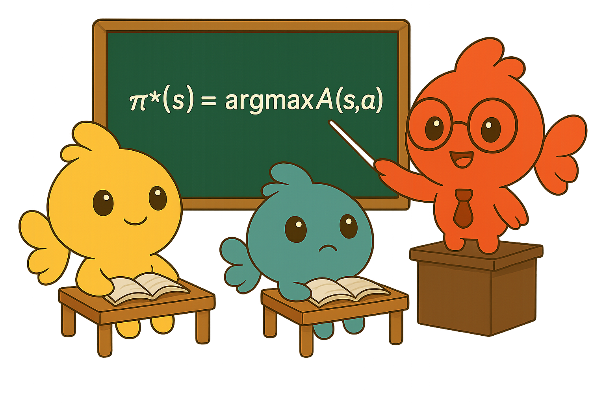

<h1 align="center">
  <a href="https://github.com/SakanaAI/RLT/">
</a><br>
<b>Reinforcement Learning Teachers of Test Time Scaling</b><br>
</h1>

<p align="center">
  📚 <a href="https://arxiv.org/abs/2506.08388">[Paper]</a> |
  🤗 <a href="https://huggingface.co/collections/SakanaAI/reinforcement-learning-teachers-6853ed251c99aa3da2228ada">[Checkpoints]</a>
  🐠 <a href="https://sakana.ai/rlt">[Blog]</a>
</p>


This repository is a central hub for the [Reinforcement Learning Teachers](https://arxiv.org/abs/2506.08388) project. We provide efficient code to train your own RLTs following our recipe, which is easily extensible for custom datasets and base models. We also provide details on our pre-trained students, together with recommendations for best usage practices.

## Installation

We recommend using **Conda** for managing environments. Our repository and models have been tested with **Python 3.11**. To replicate our Conda environment, use the following installation script:

```sh
scripts/install_08.sh
```

Otherwise, you can install all our dependencies in your own custom environment:

```sh
python -m pip install torch==2.6.0 --index-url https://download.pytorch.org/whl/cu124
python -m pip install vllm==0.8.3 tensorboard
python -m pip install flash-attn --no-build-isolation
python -m pip install flashinfer-python -i https://flashinfer.ai/whl/cu124/torch2.6/

python -m pip install --upgrade -r requirements_08.txt
```

## Running experiments

We provide pre-trained RLT reasoning models hosted on [Hugging Face](https://huggingface.co/collections/SakanaAI/reinforcement-learning-teachers-6853ed251c99aa3da2228ada).

Below, we give instructions on performing teacher training with our method and the recommended configuration files in the `cfgs/run_cfg/` folder to train our new class of Reinforcement-Learned Teachers.

Experiments are managed via the amazing [Hydra](https://hydra.cc/) library. Experiments that do not require fast vLLM generation can be run with the following script:

```sh
./launch.sh ${NUM_OF_GPUS} run_cfg/file/directory ${extra_hydra_args}
```

RL and other experiments using vLLM can be run with the following script, which first instantiates parallel vLLM servers and later connects with the main trainer class:

```sh
./launch_with_server.sh  ${NUM_OF_VLLM_GPUS} ${NUM_OF_TRAINING_GPUS} run_cfg/file/directory ${extra_hydra_args}
```

For example (on 4 total GPUs):

```sh
./launch_with_server.sh 1 3 cfgs/run_cfg/my_run_file.yaml dataset_id_or_path=my/data/path learning_rate=0.0001 ...
```

Additional custom experiments can be conducted by passing extra `hydra` arguments (e.g., `kl_penalty_reward_coeff=[0, 0]`, `dataset_id_or_path=my/data/path`, `model_name_or_path=my/custom/model`) or by modifying the relevant YAML files (e.g., `cfgs/run_cfg/teacher_sft.yaml`).

While we use distributed training with the *DeepSpeed* library and eight H100 GPUs, training should be reproducible even with smaller computational budgets (e.g., four GPUs). You can pass the `offload` argument at the end of any command to automatically activate weight and optimizer offloading to the CPU. By default, checkpoints and results are saved in the `results` folder.

### Instructions on RLT training

We recommend following the pipeline detailed in [our paper](https://arxiv.org/abs/2506.08388) to train RLTs with the example run files provided in `cfgs/run_cfg`, which have been tested on a single compute node with eight H100 GPUs.

For the initial supervised warm-up phase with the RLT format:

```sh
./launch.sh 8 cfgs/run_cfg/teacher_sft.yaml output_dir=path/to/save/pre_rl_model ${extra_hydra_args}
```

This will save a checkpoint for the final RL phase, which can take multiple days:

```sh
./launch_with_server.sh 4 4 cfgs/run_cfg/teacher_rlt.yaml model_name_or_path=path/of/saved/pre_rl_model results_dir=path/to/save/rlt_model ${extra_hydra_args}
```

All our scripts and run files currently default to a 7B RLT teacher (`model_name_or_path=Qwen/Qwen2.5-7B-Instruct`) and the `bespokelabs/Bespoke-Stratos-17k` data in order to compare our method with previous work on a fixed set of questions. Any other custom [dataset](https://huggingface.co/docs/datasets/index) and model can be used by overriding `dataset_id_or_path` or the initial `model_name_or_path` via additional command arguments, or by making separate configuration files (we provide examples in the `cfgs/data_cfg` and `cfgs/model_cfg` folders).

For custom datasets, we assume the columns `question` and `solution` contain each problem's question and solution, respectively. Moreover, an optional extra column `reasoning_trace` can be used to make the data compatible with our SFT warm-up stage. If a custom dataset does not have a `reasoning_trace` entry, we still recommend first performing the SFT warm-up phase on the default `bespokelabs/Bespoke-Stratos-17k` data before performing the RL phase on your custom dataset to obtain the best results. By default, these datasets will be formatted using the think/solution tags and system prompt from [Li et al., 2025](https://arxiv.org/abs/2502.07374). To use other tags/system prompts (such as those from [DeepSeek R1](https://github.com/deepseek-ai/DeepSeek-R1/blob/main/DeepSeek_R1.pdf)) or to extend support to datasets adhering to other custom formats, you can add a new entry to the `DATA_CONFIGS` dictionary defined in `custom_data/reasoning_datasets_info.py`.

### Student training notes

Our [RLT students](https://huggingface.co/collections/SakanaAI/reinforcement-learning-teachers-6853ed251c99aa3da2228ada) were trained based on the code and hyperparameters from [our baselines](https://github.com/NovaSky-AI/SkyThought/tree/main/skythought/train) after recollecting reasoning traces for all question/solution pairs in the same `bespokelabs/Bespoke-Stratos-17k` dataset after RL. As described in Appendix B.1, we found that larger students can be susceptible to cropped reasoning traces if they exceed the maximum context length during distillation. For this reason, we suggest recollecting multiple traces for each data point when distilling students with 32B parameters or larger to meet the context constraint; otherwise, resort to the RLT rewards.

To ensure consistency, we collected our evaluation results on AIME24, MATH500, and GPQA using the [SkyThought](https://github.com/NovaSky-AI/SkyThought) library, which was installed at commit `4bb8f3e`. We use this evaluation library with the vLLM backend. Furthermore, we set tensor parallelism to 4 for the 7B RLT student and to 8 for the 32B RLT student. We use consistent generation hyperparameters as described by our [baselines](https://github.com/NovaSky-AI/SkyThought), which we also detail in Appendix B.4.

## Additional notes

Running experiments requires downloading models and datasets hosted on [Hugging Face](https://huggingface.co/). Hence, you must log in to a Hugging Face account with an access token, [as explained here](https://huggingface.co/docs/hub/security-tokens), using the following command:

```sh
huggingface-cli login
```

The default logging functionality saves results both locally and to [Weights & Biases](https://wandb.ai/). To disable Weights & Biases logging, please modify the provided configuration files with:

```yaml
report_to: null
```

## Citation

If you find our work or this repository useful and want to cite our paper, you can use the following:

```bibtex
@article{sakana2025rlt,
  title     = {Reinforcement Learning Teachers of Test Time Scaling},
  author    = {Cetin, Edoardo and Zhao, Tianyu and Tang, Yujin},
  journal   = {arXiv preprint arXiv:2506.08388},
  year      = {2025}
}
```
